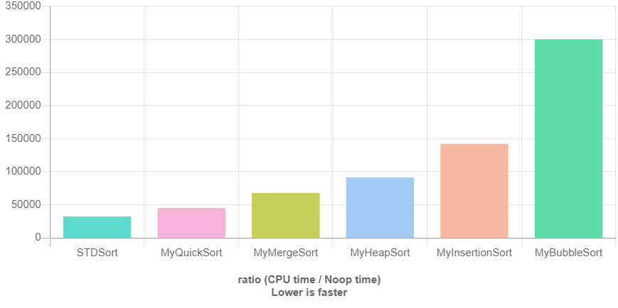

## Test: 10 elementi

* <b>STDSort</b>: 1.000 <hh5181>
* <b>MyQuickSort:</b> 1.032 <h5346>
* <b>MyMergeSort:</b>  1.05 <h5442>
* <b>MyBubbleSort:</b> 1.011 <h5240>
* <b>MyInsertionSort:</b> 1.004 <h5200>

## Test: 50 elementi

* <b>STDSort:</b> 1.000 <h7191>
* <b>MyQuickSort:</b> 1.077 <h7747>
* <b>MyMergeSort:</b> 1.211 <h8706>
* <b>MyBubbleSort:</b> 1.367 <h9832>
* <b>MyInsertionSort:</b> 1.118 <h8041>

## Test: 500 elementi

* <b>STDSort:</b> 1.000 <h35979>
* <b>MyQuickSort:</b> 1.355 <h44674>
* <b>MyMergeSort:</b> 2.174 <h71709>
* <b>MyBubbleSort:</b> 619.11 <h30338>
* <b>MyInsertionSort:</b> 14.453 <h46858>
